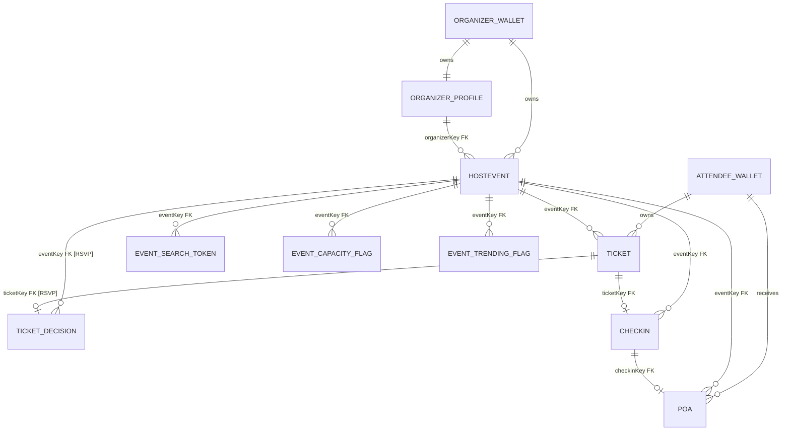

# Hostr

DEMO: [https://youtu.be/A30xTadaVnQ](https://youtu.be/A30xTadaVnQ)

Hostr is a wallet-native event app built on Arkiv. Organizers create and run events on-chain, attendees request tickets, rsvp and attendance/POA flows are recorded as linked Arkiv entities.

## Setup Guide

### 1) Clone the repository

```bash
git clone <https://github.com/akashbiswas0/Hostr>
cd Hostr
```

### 2) Install dependencies

```bash
npm install
```

### 3) Configure environment variables

```bash
cp .env.example .env
```

Update `.env` as needed:

- `OPENROUTER_API_KEY`: required for AI search/image generation routes.
- `IMAGEDB_PRIVATE_KEY`: required for image DB writes.
- `ARKIV_RPC_URL`, `ARKIV_WS_URL`, `ARKIV_CHAIN_ID`: set if you want to override network defaults.

### 4) Run locally

```bash
npm run dev
```

Open [http://localhost:3000](http://localhost:3000).

## Arkiv Integration


### Hostr uses distinct entity types with stable `type` attributes and role-specific payloads/attributes:

| Entity type | Purpose | Key queryable attributes | Field type usage |
|---|---|---|---|
| `organizer_profile` | Organizer identity | `wallet`, `displayNameNorm`, `countryCode`, `hasAvatar` | text + numeric flags |
| `user_profile` | Attendee identity | `wallet`, `displayNameNorm`, `countryCode`, `hasAvatar` | text + numeric flags |
| `hostevent` | Canonical event record | `status`, `category`, `cityNorm`, `startAt`, `endAt`, `format`, `isOnline`, `seatsRemaining`, `rsvpConfirmedCount`, `priceTier`, `hasImage` | normalized text + numeric counters/timestamps |
| `ticket` | Attendee participation | `eventKey`, `attendeeWallet`, `status`, `requestedAt`, `attendanceMode` | refs + lifecycle state + timestamps |
| `ticket_decision` | Organizer moderation decision | `eventKey`, `ticketKey`, `attendeeWallet`, `decision`, `decidedAt` | refs + decision state |
| `checkin` | Gate attendance proof | `eventKey`, `ticketKey`, `attendeeWallet`, `checkedInAt`, `checkinMethod` | refs + timestamps |
| `poa` | Proof of attendance asset | `eventKey`, `ticketKey`, `checkinKey`, `attendeeWallet`, `issuedAt` | refs + issuance state |
| `event_search_token` | Search index row | `eventKey`, `token`, `field`, `status`, `category`, `startAt` | tokenized index attributes |
| `event_capacity_flag` | Derived capacity snapshot | `eventKey`, `capacityTotal`, `confirmedCount`, `waitlistedCount`, `isSoldOut` | derived numeric metrics |
| `event_trending_flag` | Derived trend snapshot | `eventKey`, `score24h`, `newTickets24h`, `checkins24h`, `velocityBucket` | derived scoring attributes |

This separation keeps identity, event data, participation, moderation, attendance, and derived analytics independent and queryable without payload deserialization.


### Hostr uses Arkiv predicate composition (`eq`, `or`, `gte`, `lte`, `and`) with indexed attributes.

- Event discovery supports combined filters on `status`, `category`, `cityNorm`, `countryCode`, `format`, `isOnline`, `approvalMode`, `priceTier`, `language`, `hasImage`, `startAt` range, and `seatsRemaining`.
- Sorting is attribute-based using `orderBy`, including `startAt asc/desc`, `createdAt desc`, and `rsvpConfirmedCount desc`.
- Ticket/checkin/poa queries also use compound filters and deterministic ordering (`requestedAt`, `checkedInAt`, `issuedAt`).
- Keyword search uses dedicated `event_search_token` entities and weighted ranking by token field.


### All writes are signed by connected wallets

| Entity | Owner | Who can edit/delete |
|---|---|---|
| `organizer_profile`, `hostevent`, derived event entities | Organizer wallet | Organizer only (`assertCallerOwnsHostEvent`) |
| `user_profile`, `ticket` | Attendee wallet | Attendee only (`assertCallerOwnsEntity`) |
| `ticket_decision`, `checkin` | Organizer wallet | Organizer only + event-ownership checks |
| `poa` | Minted by organizer, then ownership transferred to attendee | Organizer mints; attendee ends as owner |


### References are explicit and validated:

- `hostevent.organizerKey` references `organizer_profile` and is validated at creation.
- `ticket.eventKey` must reference a valid `hostevent`.
- `ticket_decision.ticketKey` and `checkin.ticketKey` must match the same `eventKey` and `attendeeWallet`.
- `poa` validates full chain consistency across `eventKey`, `ticketKey`, and `checkinKey`.

Maintenance behavior:

- Search tokens and derived flag entities are replaced on event updates to avoid stale derived rows.
- Event purge is guarded: `purgeHostEventIfNoTickets` refuses deletion while attendee-owned tickets exist, then batch-deletes organizer-owned dependent entities (`ticket_decision`, `checkin`, `poa`, search tokens, flags) with the event.

### ER diagram (wallets + explicit relationships)




### State transitions are explicit and enforced in code:

- Hostevent lifecycle: `draft -> upcoming -> live -> ended -> archived` (validated transition map).
- Ticket lifecycle: `pending -> confirmed|waitlisted|not-going`, `waitlisted -> confirmed|not-going`, `confirmed -> checked-in|not-going`.

Reliability and reconciliation features:

- `reconcileHostEventIntegrity` recomputes counters and derived entities from source-of-truth ticket/decision/checkin graph.
- `autoTransitionEndedHostEvents` moves expired events to `ended`.
- `autoPromoteCapacityStatus` promotes `upcoming/live` based on live capacity counts.
- Uniqueness guards block duplicate active tickets per attendee/event, duplicate checkins per ticket, and duplicate POAs per checkin.


### Hostr uses different lifespans per entity type:

| Entity type | Expiration strategy | Why |
|---|---|---|
| `organizer_profile`, `user_profile` | 730 days | Long-lived identity |
| `hostevent` | until `endDate` + grace window (min 1 day) | Event remains discoverable shortly after completion |
| `ticket` | `pending`: short window; other statuses: tied to event end + grace (min 1 hour) | Operational lifecycle differs pre/post decision |
| `ticket_decision` | event end + decision grace window | Moderation trace around event lifecycle |
| `checkin` | event end + short grace | Attendance evidence near event time |
| `poa` | 730 days | Badge-like artifact for attendees |
| `event_search_token`, flags | refreshed from hostevent lifecycle | Derived/indexed data stays aligned with source event |

### Business-logic updates 

- Derived analytics as first-class entities (`event_capacity_flag`, `event_trending_flag`).
- Search indexing via dedicated `event_search_token` rows (weighted keyword retrieval).
- Reconciliation-driven event counters (`rsvpConfirmedCount`, `seatsRemaining`, `isSoldOut`) updated from graph data.
- Organizer-minted POA with on-chain ownership transfer to attendee (`changeOwnership`) for end-user custody.

## Core Arkiv files

- `lib/arkiv/entities/` (create/update/delete + integrity logic)
- `lib/arkiv/queries/` (filter/sort/discovery query model)
- `lib/arkiv/ownership.ts` (owner-only mutation guards)
- `lib/arkiv/types.ts` and `lib/arkiv/constants.ts` (schema + entity constants)
